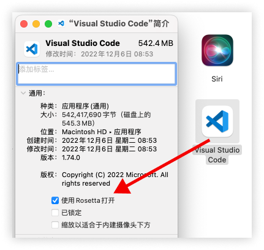

## 快速入门

- 目标：快速搭建开发环境
- 任务：VS Code 中按下 F5，AE 中弹框显示 'Hello AE'

### 1. 工具安装

### 1.1 VS Code

- [VS Code 下载](https://code.visualstudio.com/Download)

::: warning
注意：Mac M1 系列芯片的电脑，需要勾选使用 Rosetta 打开，[详情](https://marketplace.visualstudio.com/items?itemName=Adobe.extendscript-debug#known-issues)
:::

### 1.2 Adobe Extendsscript extension 插件

- [Adobe Extendscript extension](https://marketplace.visualstudio.com/items?itemName=Adobe.extendscript-debug)